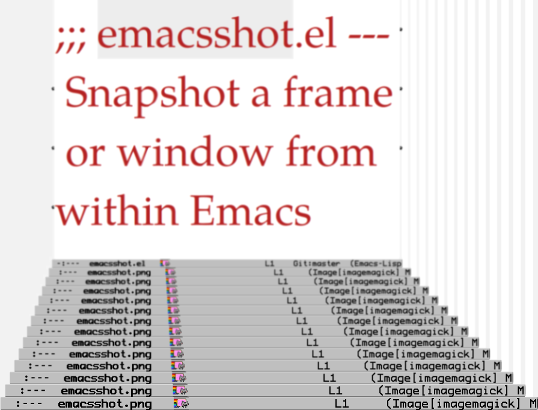

<h2>Table of Contents</h2>

<ul>
<li><a href="#org7e6e914">1. What emacsshot is</a></li>
<li><a href="#org6c574b4">2. Usage</a>
<ul>
<li><a href="#org27def47">2.1. Hide the mode-line</a></li>
</ul>
</li>
<li><a href="#orgc9bff19">3. Install</a>
<ul>
<li><a href="#org5f88b6e">3.1. Emacs Package</a></li>
<li><a href="#orga9087f5">3.2. Direct Install</a></li>
</ul>
</li>
<li><a href="#orgc7c9a7f">4. Dependencies</a></li>
<li><a href="#org8684451">5. Development</a>
<ul>
<li><a href="#org2c5d974">5.1. Lentic Literate Style</a></li>
<li><a href="#org77fff21">5.2. Ideas, Contributions, Bugs</a></li>
</ul>
</li>
<li><a href="#org5502664">6. Hints</a></li>
<li><a href="#org402a166">7. History</a></li>
</ul>

# What emacsshot is

Program emacsshot provides a few commands to take a screenshot of
Emacs from within Emacs.

# Usage

With the default settings `M-x emacsshot-snap-frame` creates file
'~/emacsshot.png' which is a snapshot of the current Emacs-frame.

There is also `M-x emacsshot-snap-window` which is for creating a
snapshot of the current Emacs-window.

Further there is function `emacsshot-snap-window-exclude-modeline`
which does as `emacsshot-snap-window` but excludes the modeline when
taking the shot.  See also section [Hide the mode-line](#org27def47).

The filenames are configurable.  Hint: `M-x customize-group emacsshot`.

It's also possible to add a timestamp to the filename as postfix.  See
`M-x customize-variable emacsshot-with-timestamp`.

It might be a good idea to bind the functions to a key.  This can
make the usage more convenient.  Further the binding is a way to
avoid images which contain the command that has been used to create
the image e.g. "M-x emacsshot-snap-frame" in the minibuffer.
Beware of the heisenshot!

Concretely the print-key could trigger the shot.  Evaluation of

    (global-set-key [print] 'emacsshot-snap-frame)

yields this behavior.

Or evaluate

    (global-set-key [print]
     (lambda (&optional current-window)
      (interactive "P")
      (if current-window (emacsshot-snap-window)
        (emacsshot-snap-frame))))

to be able to snap the frame by pressing the print-key and to snap the
current window by prefixing the keypress with C-u.

Note that emacsshot currently trys to overwrite any existing file with
the target name without asking.

## Hide the mode-line

If you don't want the mode-line in your emacsshot you can switch it
off with `hidden-mode-line-mode` from Bastien Guerry available at
<http://bzg.fr/emacs-hide-mode-line.html>.

# Install

## Emacs Package

When emacsshot has been installed as elpa-package
 then the functions
are available without need of further action.

## Direct Install

Activate this program by loading it into Emacs and evaluate it with
`M-x eval-buffer`.

Automatically activate this program at Emacs start by adding the lines

    (add-to-list 'load-path "/...path to this program...")
    (require 'emacsshot)

to your .emacs or whatever you use for Emacs intitialization.

# Dependencies

-   Emacs is running under X.
-   The programm `convert` of the ImageMagick-suite is available.

`convert` actually creates the snapshots.

# Development

## Lentic Literate Style

This program is written in Emacs Lisp in lentic style based on the
'lentic' package .

This means the that this file can be regarded just as an Emacs Lisp
file.  But actually this file contains extra comments which allow the
interpretation of the file as Org file.  Lentic-mode makes it easy to
write this style.

A possible initialization of lentic is this:

    (global-lentic-start-mode)

Find more about lentic at
.

## Ideas, Contributions, Bugs

Contributions, ideas and bug-reports are welcome.

Please use the infrastructure of github for communication.  See
<https://github.com/marcowahl/emacsshot/issues>.

# Hints

There is elpa-package 'screenshot' which allows to pick windows
with the mouse, even windows from non-Emacs (!) programs.  See
<http://melpa.org/#/screenshot>.  BTW 'screenshot' has even more!

emacsshot only takes images of Emacs.

# History

<table border="2" cellspacing="0" cellpadding="6" rules="groups" frame="hsides">

<colgroup>
<col  class="org-right" />

<col  class="org-left" />
</colgroup>
<tbody>
<tr>
<td class="org-right">201501071941</td>
<td class="org-left">New function to take snapshot of a window</td>
</tr>

<tr>
<td class="org-right">201505162319</td>
<td class="org-left">Optionally add timestamp to save-filename</td>
</tr>
</tbody>
</table>
